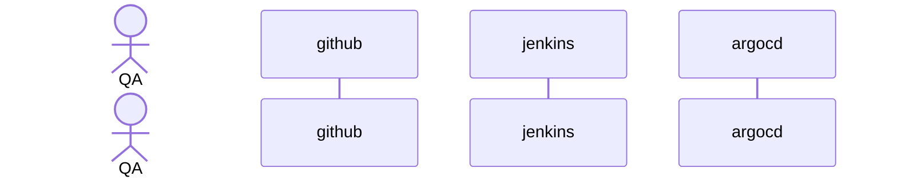
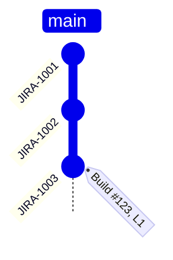

# Playground
This is my github play ground. 

```mermaid
sequenceDiagram
    actor QA
    participant github
    participant jenkins
    participant argocd
```

``` mermaid
    gitGraph TB:
       commit id: "JIRA-1001"
       commit id: "JIRA-1002"
       commit id: "JIRA-1003" tag: "Build #123, L1"
     
```
